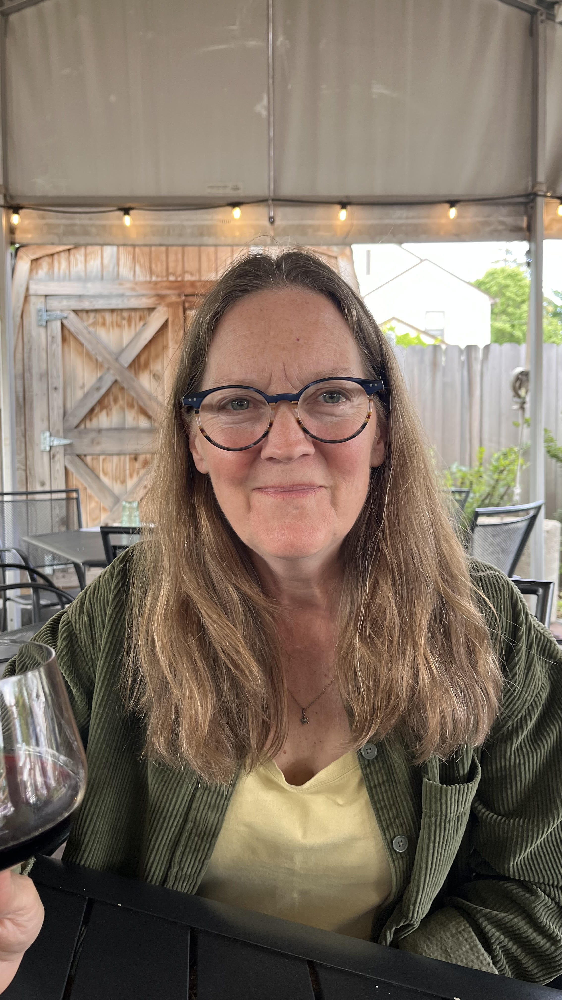

# About Me

  
  
Hi, I'm Maggie, the author of <strong>[Santana Rose]</strong>. I love exploring themes related to [key themes or genres of the book].

In addition to writing, I enjoy [personal interests]. I'm passionate about storytelling, creativity, and engaging with readers like you!

<svg height="100" width="100">
  <circle cx="50" cy="50" r="40" stroke="white" stroke-width="2" fill="#3498db" />
</svg>

  <a href="./readme.md" style="font-size: 16px; text-decoration: none; color: #3498db;">Back to Main Page</a>

